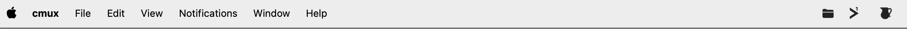
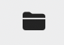

# VaultyShot

A lightweight macOS menu bar app that automatically captures, organizes, and stores all your screenshots in one place.



## What it does

VaultyShot lives in your menu bar as a small folder icon and works silently in the background.



**It captures screenshots from two sources:**

| Shortcut | macOS behavior | VaultyShot behavior |
|---|---|---|
| `Cmd + Shift + 3` | Saves full screen to Desktop | Detects the new file, moves it to `~/VaultyShot/` |
| `Cmd + Shift + 4` | Saves selection to Desktop | Detects the new file, moves it to `~/VaultyShot/` |
| `Cmd + Shift + Ctrl + 3` | Copies full screen to clipboard | Detects clipboard image, saves it to `~/VaultyShot/` |
| `Cmd + Shift + Ctrl + 4` | Copies selection to clipboard | Detects clipboard image, saves it to `~/VaultyShot/` |

**Click the folder icon to access your screenshots:**

- Thumbnail preview for each screenshot
- Click to open in Preview
- Hover to reveal actions: **copy**, **reveal in Finder**, **delete**
- Screenshot count in the header
- "Open Folder" to jump to `~/VaultyShot/` in Finder

## How it works

```
┌─────────────────────────────────────────────────┐
│                   VaultyShot                    │
│                                                 │
│   ┌──────────────┐     ┌──────────────────┐     │
│   │ File Watcher │────▶│                  │     │
│   │  (FSEvents)  │     │   ~/VaultyShot/  │     │
│   └──────────────┘     │                  │     │
│                        │  Organized PNG   │     │
│   ┌──────────────┐     │  storage with    │     │
│   │  Clipboard   │────▶│  thumbnails      │     │
│   │   Watcher    │     │                  │     │
│   └──────────────┘     └──────────────────┘     │
│                              │                  │
│                              ▼                  │
│                     ┌────────────────┐          │
│                     │ Menu Bar       │          │
│                     │ Popover UI     │          │
│                     └────────────────┘          │
└─────────────────────────────────────────────────┘
```

- **File Watcher** — Monitors your screenshot directory (Desktop by default) using macOS FSEvents. When a new screenshot file appears, it moves it to `~/VaultyShot/`.
- **Clipboard Watcher** — Polls the system pasteboard every 0.8s. When a new image is copied via `Cmd+Shift+Ctrl`, it saves it as a PNG in `~/VaultyShot/`.
- **Popover UI** — SwiftUI view with async thumbnails (via QuickLookThumbnailing), hover actions, and quick access.

## Installation

### Requirements

- macOS 14.0 (Sonoma) or later
- Xcode 16+ (for building)
- [XcodeGen](https://github.com/yonaskolb/XcodeGen) (for project generation)

### Build from source

```bash
# 1. Clone the repo
git clone https://github.com/Nelahia/vaulty-shot.git
cd vaulty-shot

# 2. Install XcodeGen (if not installed)
brew install xcodegen

# 3. Generate the Xcode project
xcodegen generate

# 4. Build the app
xcodebuild -project VaultyShot.xcodeproj \
  -scheme VaultyShot \
  -configuration Release \
  -derivedDataPath build

# 5. Run the app
open build/Build/Products/Release/VaultyShot.app
```

### Optional: Copy to Applications

```bash
sudo cp -R build/Build/Products/Release/VaultyShot.app /Applications/
```

### Launch at login (optional)

1. Open **System Settings** → **General** → **Login Items**
2. Click **+** and select `VaultyShot.app`

## Project structure

```
VaultyShot/
├── VaultyShotApp.swift            # Entry point, AppDelegate, NSStatusItem
├── AppState.swift                 # Observable state manager
├── Services/
│   ├── ScreenshotWatcher.swift    # FSEvents file system watcher
│   ├── ScreenshotStorage.swift    # File operations (move, load, delete)
│   └── ClipboardWatcher.swift     # Pasteboard monitor for clipboard screenshots
├── Models/
│   └── ScreenshotItem.swift       # Screenshot data model
├── Views/
│   ├── PopoverView.swift          # Main popover layout
│   ├── ScreenshotRow.swift        # Individual screenshot row with actions
│   ├── AsyncThumbnail.swift       # Async thumbnail via QuickLookThumbnailing
│   └── EmptyStateView.swift       # Empty state placeholder
├── Info.plist
└── VaultyShot.entitlements
```

## Tech stack

- **Swift 5.9** + **SwiftUI** + **AppKit**
- **FSEvents** via `DispatchSource` for file monitoring
- **NSPasteboard** polling for clipboard capture
- **QuickLookThumbnailing** for async thumbnail generation
- **No external dependencies**

## License

MIT
